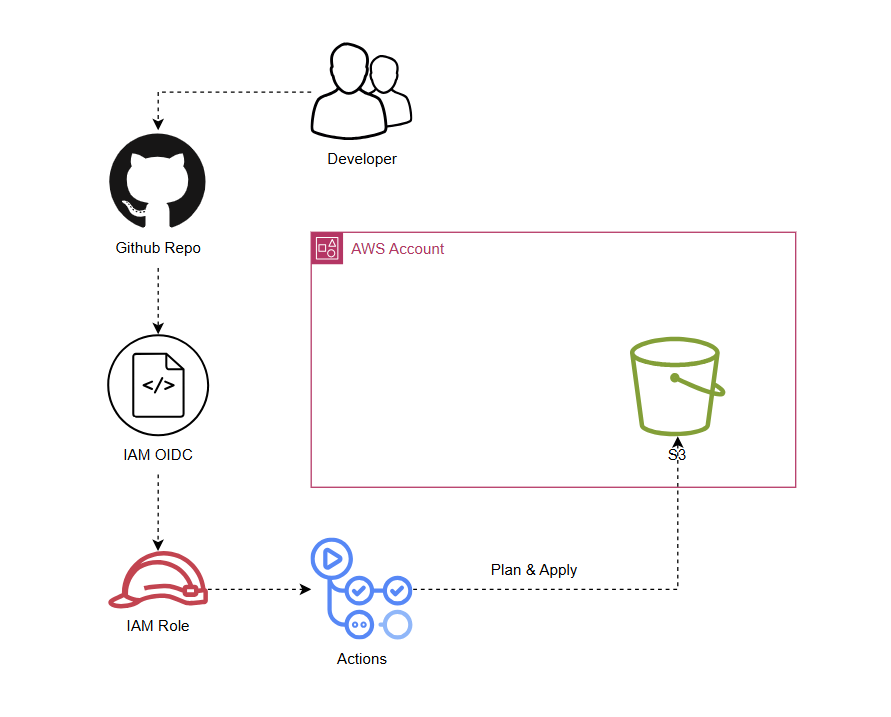

# 🚀 AWS GitHub OIDC — Secure Multi-Environment Deployments

Easily set up secure, multi-environment AWS deployments from GitHub Actions using OpenID Connect (OIDC) — no long-lived AWS access keys required! This solution enables clean, environment-aware deployments across dev, preprod, and prod environments, with strong security and a manual approval workflow.


---

## 🏗️ Architecture Overview





**How it works:**

GitHub's OIDC provider allows GitHub Actions to assume AWS IAM roles with temporary credentials, providing:


- **Security**: No long-lived AWS keys stored in GitHub
- **Fine-grained access**: Environment-specific IAM roles with least privilege
- **Multi-environment support**: Deploy to multiple AWS accounts from a single repository
- **Manual approval workflow**: Review Terraform plans before deployment


---

## ✨ Features


- **OIDC Authentication** — Secure authentication using GitHub's OIDC provider
- **Multi-Environment Support** — Separate configurations for dev, preprod, and prod
- **Terraform Integration** — Infrastructure as Code with S3 backend
- **Manual Approval Process** — Review and approve deployments via GitHub Issues
- **Environment Isolation** — Deploy to different AWS accounts per environment


---

## 📁 Repository Structure

```
├── .github/
│   └── workflows/
│       └── deploy-terraform.yml    # GitHub Actions workflow
├── terraform/
│   ├── main.tf                    # Main Terraform configuration
│   ├── providers.tf               # AWS provider and backend configuration
│   ├── variables.tf               # Variable definitions
│   ├── outputs.tf                 # Output definitions
│   ├── versions.tf                # Terraform version constraints
│   └── stage_variables/
│       ├── dev/
│       │   └── ap-south-1.tfvars      # Dev environment variables for ap-south-1
│       ├── preprod/
│       │   └── ap-south-1.tfvars      # Preprod environment variables for ap-south-1
│       └── prod/
│           └── ap-south-1.tfvars      # Prod environment variables for ap-south-1
├── screenshots/                   # Documentation screenshots and blog content
└── README.md                      # This file
```


---

## 🛠️ Setup Instructions


### 1️⃣ Create GitHub OIDC Identity Provider in AWS

1. Navigate to AWS IAM Console → Identity Providers
2. Create a new Identity Provider with:
   - **Provider type**: OpenID Connect
   - **Provider URL**: `https://token.actions.githubusercontent.com`
   - **Audience**: `sts.amazonaws.com`


### 2️⃣ Create IAM Role for GitHub Actions

1. Create a new IAM Role with "Custom trust policy"
2. Use the following trust policy (replace with your account ID and repository):

```json
{
  "Version": "2012-10-17",
  "Statement": [
    {
      "Effect": "Allow",
      "Principal": {
        "Federated": "arn:aws:iam::<account_id>:oidc-provider/token.actions.githubusercontent.com"
      },
      "Action": "sts:AssumeRoleWithWebIdentity",
      "Condition": {
        "StringEquals": {
          "token.actions.githubusercontent.com:aud": "sts.amazonaws.com"
        },
        "StringLike": {
          "token.actions.githubusercontent.com:sub": "repo:your-username/aws-github-oidc:*"
        }
      }
    }
  ]
}
```

3. Attach appropriate permissions (e.g., `AmazonS3FullAccess` for this demo)
4. Name the role according to your environment (e.g., `github-oidc-dev-role`)


### 3️⃣ Configure GitHub Secrets

1. Go to your repository → Settings → Repository secrets
2. Add the following secrets

**Secrets:**

- `AWS_DEPLOYMENT_ROLE`: ARN of the IAM role created in Step 2
- `TF_S3_BACKEND_BUCKET_NAME`: S3 bucket name for Terraform state
- `MY_GITHUB_TOKEN`: Github token


### 4️⃣ Prepare Terraform Backend

Ensure you have an S3 bucket for Terraform state storage in your target AWS account.


---

## 🚦 Usage


### 🚀 Deploy Infrastructure

1. Navigate to Actions tab in your GitHub repository
2. Select "Deploy Terraform" workflow
3. Click "Run workflow"
4. Choose your target environment and region (dev/preprod/prod)
5. Review the Terraform plan in the generated GitHub Issue
6. Approve the deployment to proceed


#### 📝 Workflow Process

1. **Checkout**: Code is checked out from the repository
2. **Setup**: Terraform is installed and AWS credentials are configured via OIDC
3. **Initialize**: Terraform backend is initialized with environment-specific state
4. **Validate**: Terraform configuration is validated
5. **Plan**: Terraform plan is generated and saved
6. **Approval**: Manual approval is requested via GitHub Issue
7. **Apply**: Upon approval, Terraform applies the changes


---

## 🔧 Terraform Configuration

The Terraform configuration creates a simple S3 bucket with environment-specific naming:

```hcl
resource "aws_s3_bucket" "main" {
  bucket = "github-oidc-${data.aws_caller_identity.current.account_id}-${var.environment}"
}
```

Environment-specific variables are managed through `.tfvars` files in the `terraform/stage_variables/` directory.


---

## 🌍 Multi-Account Setup

To deploy to multiple AWS accounts:

1. **Repeat Steps 1 & 2** in each target AWS account
2. **Create separate GitHub environments** for each account (dev, preprod, prod)
3. **Configure environment-specific secrets and variables** for each environment
4. **Run the workflow** selecting the appropriate environment


---

## 🔒 Security Best Practices

- **Least Privilege**: IAM roles have minimal required permissions
- **Environment Isolation**: Separate roles and accounts for each environment
- **Temporary Credentials**: No long-lived AWS keys stored anywhere
- **Audit Trail**: All deployments are logged and traceable
- **Manual Approval**: Critical deployments require explicit approval

---


---

---

🌟 **Happy deploying!** 🚀

If you have questions, feedback, or want to connect and discuss cloud, DevOps, or open source:

- Open a [GitHub Issue](https://github.com/ravisrma/aws-github-oidc/issues)
- Or connect with me on [LinkedIn](https://www.linkedin.com/in/ravi-0527/) — I love meeting fellow builders!

Let’s build something awesome together! 💬🤝